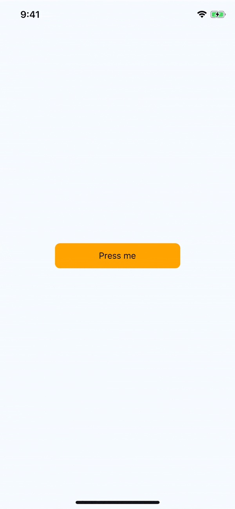

# React Native Walkthrough Tooltip

> Much credit belongs to @jeanregisster and the [react-native-popover](https://github.com/jeanregisser/react-native-popover) library. Most of the animations and geomery computation belong to his library. Please check it out! It was an invaluble resource.

## Tooltip

React Native Walkthrough Tooltip is a fullscreen modal that highlights whichever element it wraps.\
When not visible, the wrapped element is displayed normally.


### Example Usage

```js
<Tooltip
  animated
  isVisible={this.state.toolTipVisible}
  content={<Text>Check this out!</Text>}
  placement="top"
  onClose={() => this.setState({ toolTipVisible: false })}
>
  <TouchableHighlight style={styles.touchable}>
    <Text>Press me</Text>
  </TouchableHighlight>
</Tooltip>
```

### How it works
The tooltip wraps an element _in place_ in your React Native rendering. When it initially renders, it measures the location of the element in the window, utilizing [React Native's 
measureInWindow](https://facebook.github.io/react-native/docs/direct-manipulation.html#measureinwindowcallback). When the tooltip is displayed, it renders a _copy_ of the wrapped element positioned absolutely on the screen at the coordinates returned after measuring. This allows you to touch the element in the tooltip modal rendered above your current screen.

Optionally, you can provide the props `onChildPress` or `onChildLongPress` to override the functionality of the current element, should you find that useful. More information on this [can be found below](onPress).

### Props


Prop name        | Type             | Default value                          | Description
---------------- | ---------------- | -------------------------------------- | -----------
animated         | bool             | false                                  | When true, tooltip will animate in/out when showing/hiding
arrowSize        | `Size`           | { width: 16, height: 8 }               | The dimensions of the arrow on the bubble pointing to the highlighted element
backgroundColor  | string           | 'rgba(0,0,0,0.5)'                      | Color of the fullscreen background beneath the tooltip
content          | function/Element |  `<View />`                            | This is the view displayed in the tooltip popover bubble
displayArea      | `Rect`           | fullscreen `Rect` with 24px of padding | Screen area where the tooltip may be displayed
isVisible        | bool             | false                                  | When true, tooltip is displayed
onChildLongPress | function         | null                                   | Callback when user long presses on wrapped child. **_Overrides_** any touches in wrapped child element. [See below for more info](onPress)
onChildPress     | function         | null                                   | Callback when user long presses on wrapped child. **_Overrides_** any touches in wrapped child element. [See below for more info](onPress)
onClose          | function         | null                                   | Callback fired when the user taps the tooltip background overlay
placement        | string           | 'auto'                                 | Where to position the tooltip - options: `top, bottom, left, right, auto`. When `auto` is specified, the library will determine the ideal placement so that the popover is fully visible within `displayArea`.

### Class definitions for props

- `Rect` is an object with properties: `{ x: number, y: number, width: number, height: number }`
- `Size` is an object with properties: `{ width: number, height: number }`


<a name="onPress"></a>
### onChildPress and onChildLongPress
When providing either of these functions, React Native Walkthrough Tooltip will wrap your entire child element in a touchable like so:
```js
<TouchableWithoutFeedback onPress={onChildPress} onLongPress={onChildLongPress}>
  {childElement}
</TouchableWithoutFeedback>
```

** NOTE: This will disable and override any touch events on your child element** 

One possible use case for these functions would be a scenerio where you are highlighting new functionality and want to restrict a user to ONLY do a certain action when they press on an element. While perhaps uncommon, this use case was relevant for another library I am working on, so it may be useful for you. When these props are NOT provided, all touch events on children occur as expected.

